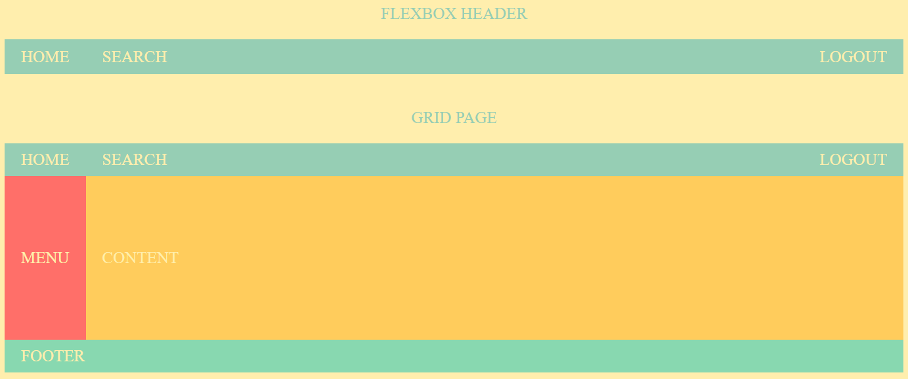

# [Learn CSS Grid for free](https://scrimba.com/learn/cssgrid)
 
You'll learn all the key concepts while building three awesome layouts: a website, an image grid, and an article. Plus, you'll learn how to combine CSS Grid with Flexbox.

## Projects

### Grid page with flexbox header

 
 

### An Awesome Image Grid

## I learned

- CSS Grid fundamentals

- Starting with grid

- Responsive grids

- Fraction units

- Repeat

- Positioning items
 
- Template areas

- Auto-fit

- minmax

- Implicit rows

- Named lines

- justify-items

- align-items

- auto-fit vs auto-fill

- Create an article layout

- An awesome image grid