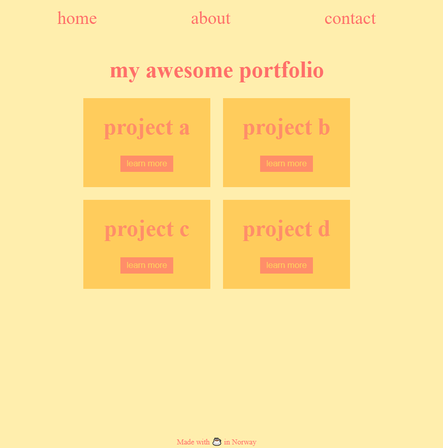

# [Learn CSS variables](https://scrimba.com/learn/cssvariables)
 
This tutorial teaches you CSS variables. It's value-packed from beginning to end, and is probably the fastest way to get an in-depth understanding of CSS Variables.
They are a part of the DOM, which has a lot of benefits.

## The project we worked with

## I learned

- Fundamentals of CSS Variables

- Local variables and overriding

- Creating themes with variables

- Changing variables with JavaScript

- Responsiveness with CSS Variables